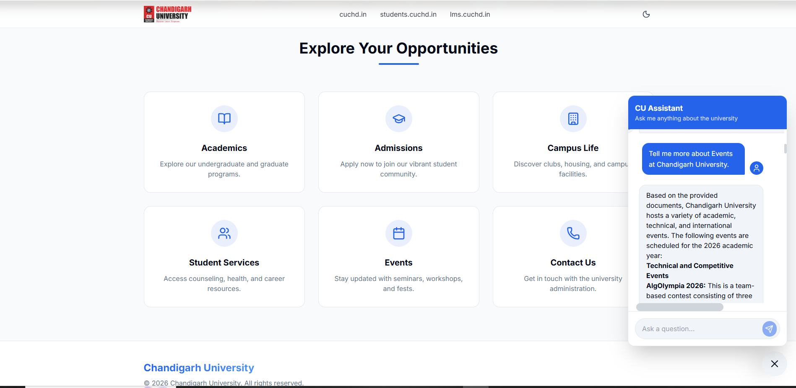

# 🔬 RAG Academic Chatbot

> **Research-Grade RAG-Based Academic Chatbot System**

A research-grade **Retrieval-Augmented Generation (RAG)** chatbot system designed for academic document querying. The system ingests institutional documents (PDFs and text files), processes them into semantically searchable chunks, and generates grounded, hallucination-controlled responses using Google's Gemini LLM — all served through a modern React-based interface.

---

## 📸 Screenshots

| Hero Section | Important Links | Chatbot Interaction |
|:---:|:---:|:---:|
|  |  |  |

---

## 📋 Table of Contents

- [Features](#-features)
- [Architecture](#-architecture)
- [Tech Stack (Detailed)](#-tech-stack-detailed)
- [Project Structure](#-project-structure)
- [Prerequisites](#-prerequisites)
- [Installation](#-installation)
- [Training the RAG Pipeline](#-training-the-rag-pipeline)
- [Running the Application](#-running-the-application)
- [API Reference](#-api-reference)
- [Configuration](#-configuration)
- [Evaluation Metrics](#-evaluation-metrics)
- [Tools Used](#-tools-used)
- [Troubleshooting](#-troubleshooting)

---

## ✨ Features

- **Document Ingestion** — Supports `.txt` and `.pdf` file formats with automatic text extraction
- **Intelligent Chunking** — Overlapping sliding-window text chunking for optimal context preservation
- **Semantic Search** — FAISS-powered vector similarity search over document embeddings
- **Grounded Generation** — Gemini LLM generates responses strictly grounded in retrieved context
- **Hallucination Control** — Strict prompt engineering ensures the model only answers from provided documents
- **Source Attribution** — Every response includes source document citations with similarity scores
- **Latency Tracking** — End-to-end latency measurement for performance benchmarking
- **Rate Limit Handling** — Built-in exponential backoff retry mechanism for API rate limits
- **Research Evaluation** — Modular evaluation framework with retrieval and generation metrics
- **Modern UI** — Dark-themed, responsive React frontend with real-time chat interface

---

## 🏗 Architecture

```
┌─────────────────────────────────────────────────────────────────┐
│                        FRONTEND (React + Vite)                  │
│  ┌──────────┐  ┌──────────┐  ┌─────────────┐  ┌─────────────┐  │
│  │ InputBar │→ │ChatContainer│→│MessageBubble│  │ SourcePanel │  │
│  └──────────┘  └──────────┘  └─────────────┘  └─────────────┘  │
│                         ↕ HTTP (Vite Proxy)                     │
├─────────────────────────────────────────────────────────────────┤
│                     BACKEND (FastAPI + Uvicorn)                  │
│  ┌─────────┐   ┌──────────────┐   ┌───────────────────────┐    │
│  │ /chat   │ → │  Retriever   │ → │     Generator         │    │
│  │ /health │   │ (FAISS + ST) │   │ (Gemini API + Prompt) │    │
│  └─────────┘   └──────────────┘   └───────────────────────┘    │
│                        ↕                    ↕                   │
│            ┌──────────────────┐   ┌──────────────────┐          │
│            │  FAISS Index     │   │  Google Gemini    │          │
│            │  (faiss_index.bin)│  │  (gemini-flash)   │          │
│            └──────────────────┘   └──────────────────┘          │
├─────────────────────────────────────────────────────────────────┤
│                    TRAINING PIPELINE (Offline)                   │
│  ┌──────────────┐   ┌──────────────┐   ┌──────────────┐        │
│  │  Raw Docs    │ → │ Preprocessor │ → │   Embedder   │        │
│  │ (.txt/.pdf)  │   │  (Chunking)  │   │ (FAISS + ST) │        │
│  └──────────────┘   └──────────────┘   └──────────────┘        │
└─────────────────────────────────────────────────────────────────┘
```

### Pipeline Flow

1. **Preprocessing** — Raw documents are loaded, cleaned, and split into overlapping word-level chunks
2. **Embedding** — Each chunk is encoded into a 384-dimensional vector using Sentence Transformers
3. **Indexing** — Vectors are stored in a FAISS `IndexFlatL2` index for exact L2 nearest-neighbor search
4. **Retrieval** — At query time, the user query is embedded and the top-K nearest chunks are retrieved
5. **Generation** — Retrieved chunks are injected into a structured prompt and sent to Gemini for grounded response generation

---

## 🛠 Tech Stack (Detailed)

### Backend

| Technology | Version | Purpose | Details |
|---|---|---|---|
| **Python** | 3.11 | Core runtime | Primary language for all backend logic, pipeline scripts, and API |
| **FastAPI** | Latest | REST API framework | Asynchronous Python web framework for building the `/chat` and `/health` endpoints; supports automatic OpenAPI schema generation and Pydantic validation |
| **Uvicorn** | Latest | ASGI server | Lightning-fast ASGI server that runs the FastAPI application; supports hot-reload during development |
| **Pydantic** | v2 | Data validation | Used for defining `ChatRequest` and `ChatResponse` schemas with automatic type validation and serialization |
| **Sentence Transformers** | Latest | Embedding model | Provides the `all-MiniLM-L6-v2` model — a lightweight 384-dimensional sentence embedding model fine-tuned on 1B+ sentence pairs (22.7M parameters, ~80MB) |
| **FAISS (faiss-cpu)** | Latest | Vector search engine | Facebook AI Similarity Search library; uses `IndexFlatL2` for exact L2 (Euclidean) distance nearest-neighbor search over chunk embeddings |
| **Google Generative AI** | Latest | LLM API client | Python SDK for Google's Gemini API; used to send grounded prompts and receive generated responses via `gemini-flash-latest` model |
| **PyPDF** | Latest | PDF text extraction | Lightweight PDF reader used in the preprocessing pipeline to extract text content from uploaded PDF documents |
| **NumPy** | Latest | Numerical computing | Used for array manipulation of embedding vectors before FAISS indexing |
| **python-dotenv** | Latest | Environment management | Loads the `GEMINI_API_KEY` and other environment variables from the `.env` file |
| **python-multipart** | Latest | Form data parsing | Required by FastAPI for handling multipart form data in HTTP requests |
| **tqdm** | Latest | Progress bars | Displays progress bars during batch embedding generation in the training pipeline |
| **Markdown** | Latest | Text processing | Utility for markdown-formatted text handling |

### Frontend

| Technology | Version | Purpose | Details |
|---|---|---|---|
| **React** | 18.2 | UI library | Component-based JavaScript library for building the interactive chat interface with state management via `useState` and `useCallback` hooks |
| **Vite** | 5.4 | Build tool & dev server | Next-generation frontend build tool providing instant HMR (Hot Module Replacement), optimized production builds, and a built-in dev proxy for API routing |
| **Tailwind CSS** | 3.4 | Utility-first CSS framework | Used for all styling with a custom dark theme (`rag-bg`, `rag-primary`, `rag-surface`, etc.) defined in `tailwind.config.js` |
| **PostCSS** | 8.4 | CSS transformer | Processes Tailwind CSS directives and applies vendor prefixes via Autoprefixer |
| **Autoprefixer** | 10.4 | CSS compatibility | Automatically adds vendor prefixes to CSS rules for cross-browser compatibility |
| **@vitejs/plugin-react** | 4.2 | React integration | Vite plugin that enables Fast Refresh for React components and JSX transformation |

### AI / ML Models

| Model | Provider | Parameters | Dimensions | Purpose |
|---|---|---|---|---|
| **all-MiniLM-L6-v2** | Hugging Face / Sentence Transformers | 22.7M | 384 | Converts text chunks and queries into dense vector embeddings for semantic similarity search |
| **gemini-flash-latest** | Google DeepMind | — | — | Large language model used for generating grounded, context-aware responses from retrieved document chunks |

### Infrastructure

| Component | Technology | Details |
|---|---|---|
| **Vector Database** | FAISS (`IndexFlatL2`) | Exact L2 nearest-neighbor search; index stored as a binary file (`faiss_index.bin`, ~220KB for 41 documents) |
| **Data Storage** | JSON flat file | Processed chunks stored in `processed_chunks.json` with metadata (id, text, source, word positions) |
| **API Communication** | HTTP REST + Vite Proxy | Frontend communicates with backend via Vite's dev proxy (`/chat` → `http://127.0.0.1:8000`) |
| **Environment Config** | `.env` file | Stores sensitive configuration like `GEMINI_API_KEY` |

---

## 📁 Project Structure

```
rag_chatbot/
├── backend/
│   ├── api/
│   │   ├── __init__.py
│   │   └── app.py                    # FastAPI application — /chat and /health endpoints
│   ├── scripts/
│   │   ├── __init__.py
│   │   ├── preprocess.py             # Document loading, cleaning, and chunking pipeline
│   │   ├── embed.py                  # Embedding generation and FAISS index creation
│   │   ├── retrieve.py               # Semantic retrieval using FAISS nearest-neighbor search
│   │   └── generate.py               # Gemini LLM response generation with prompt engineering
│   ├── evaluation/
│   │   ├── __init__.py
│   │   ├── retrieval_metrics.py      # Top-K Accuracy, Mean Reciprocal Rank (MRR)
│   │   └── generation_metrics.py     # BLEU, ROUGE, hallucination detection (placeholder)
│   ├── data/
│   │   ├── raw_docs/                 # Source documents (.txt, .pdf) — 41 files
│   │   └── processed_chunks.json     # Preprocessed text chunks with metadata
│   ├── embeddings/
│   │   └── faiss_index.bin           # Serialized FAISS vector index
│   ├── config.py                     # Centralized configuration (model names, paths, hyperparameters)
│   ├── requirements.txt              # Python dependencies
│   ├── .env                          # Environment variables (GEMINI_API_KEY)
│   └── rag_system.log                # Application logs
│
├── frontend/
│   ├── src/
│   │   ├── components/
│   │   │   ├── ChatContainer.jsx     # Scrollable message list container
│   │   │   ├── MessageBubble.jsx     # Individual message rendering (user/bot)
│   │   │   ├── InputBar.jsx          # Query input with send button
│   │   │   ├── SourcePanel.jsx       # Retrieved document sources display with scores
│   │   │   └── TypingIndicator.jsx   # Animated loading indicator
│   │   ├── App.jsx                   # Root component with chat logic and welcome screen
│   │   ├── main.jsx                  # React entry point
│   │   └── index.css                 # Global styles and Tailwind imports
│   ├── index.html                    # HTML entry point
│   ├── vite.config.js                # Vite config with API proxy settings
│   ├── tailwind.config.js            # Custom dark theme color palette
│   ├── postcss.config.js             # PostCSS plugin configuration
│   └── package.json                  # Node.js dependencies and scripts
│
├── .gitignore
└── README.md
```

---

## 📦 Prerequisites

- **Python** 3.11+
- **Node.js** 18+ and **npm** 9+
- **Google Gemini API Key** — Obtain from [Google AI Studio](https://aistudio.google.com/app/apikey)

---

## 🚀 Installation

### 1. Clone the Repository

```bash
git clone <repository-url>
cd rag_chatbot
```

### 2. Backend Setup

```bash
cd backend

# Create and activate virtual environment
python -m venv venv
.\venv\Scripts\activate          # Windows
# source venv/bin/activate       # Linux/macOS

# Install Python dependencies
pip install -r requirements.txt
```

### 3. Configure Environment Variables

Create a `.env` file in the `backend/` directory:

```env
GEMINI_API_KEY=your_gemini_api_key_here
```

### 4. Frontend Setup

```bash
cd ../frontend
npm install
```

---

## 🎓 Training the RAG Pipeline

Before the chatbot can answer queries, you must process your documents and build the vector index.

### Step 1: Add Documents

Place your `.txt` and/or `.pdf` files in:

```
backend/data/raw_docs/
```

> **Important:** Ensure all text files are saved with **UTF-8 encoding** to prevent data loss during processing.

### Step 2: Preprocess Documents

This step loads all documents, cleans the text, and splits them into overlapping chunks:

```bash
cd backend
.\venv\Scripts\activate
python -m scripts.preprocess
```

**Output:** `backend/data/processed_chunks.json` — contains all chunks with metadata (id, text, source, word positions).

### Step 3: Generate Embeddings & Build FAISS Index

This step encodes all chunks into 384-dimensional vectors and builds the FAISS index:

```bash
python -m scripts.embed
```

**Output:** `backend/embeddings/faiss_index.bin` — the serialized vector index used for retrieval.

### Retraining with New Data

To add new documents and retrain:

```bash
# 1. Add new files to backend/data/raw_docs/
# 2. Rerun the pipeline:
python -m scripts.preprocess
python -m scripts.embed
# 3. Restart the backend server
```

---

## ▶ Running the Application

### Start the Backend Server

```bash
cd backend
.\venv\Scripts\activate
python -m uvicorn api.app:app --host 127.0.0.1 --port 8000
```

The API will be available at `http://127.0.0.1:8000`.

> **Note:** Avoid using the `--reload` flag on Windows to prevent file-locking conflicts with the logging system.

### Start the Frontend Dev Server

```bash
cd frontend
npm run dev
```

The frontend will be available at `http://localhost:5173`.

### Access the Application

Open your browser and navigate to **http://localhost:5173**. The Vite dev proxy automatically routes API calls (`/chat`, `/health`) to the backend.

---

## 📡 API Reference

### `POST /chat`

Send a query and receive a grounded response with source attribution.

**Request Body:**

```json
{
  "query": "What internship programs are available?",
  "k": 10
}
```

| Parameter | Type | Default | Description |
|---|---|---|---|
| `query` | `string` | (required) | The user's natural language question |
| `k` | `integer` | `10` | Number of document chunks to retrieve |

**Response:**

```json
{
  "answer": "Based on the provided documents...",
  "retrieved_docs": [
    {
      "id": "walmart internship 2026.txt_0",
      "text": "Walmart Global Tech India...",
      "source": "walmart internship 2026.txt",
      "start_word": 0,
      "end_word": 150,
      "score": 0.91
    }
  ],
  "scores": [0.91, 0.92, ...],
  "latency_ms": 2345.67,
  "model": "gemini-flash-latest"
}
```

### `GET /health`

Health check endpoint.

**Response:**

```json
{
  "status": "healthy"
}
```

---

## ⚙ Configuration

All configuration is centralized in `backend/config.py`:

| Parameter | Default | Description |
|---|---|---|
| `EMBEDDING_MODEL_NAME` | `all-MiniLM-L6-v2` | Sentence Transformer model for generating embeddings |
| `GEMINI_MODEL_NAME` | `gemini-flash-latest` | Google Gemini model for response generation |
| `CHUNK_SIZE` | `150` | Number of words per text chunk |
| `CHUNK_OVERLAP` | `50` | Number of overlapping words between consecutive chunks |
| `TOP_K` | `10` | Number of most similar chunks to retrieve per query |
| `TEMPERATURE` | `0.2` | LLM generation temperature (lower = more deterministic) |
| `MAX_OUTPUT_TOKENS` | `2048` | Maximum tokens in the generated response |

---

## 📊 Evaluation Metrics

The system includes a modular evaluation framework under `backend/evaluation/`:

### Retrieval Metrics (`retrieval_metrics.py`)

| Metric | Description |
|---|---|
| **Top-K Accuracy** | Checks if any ground-truth chunk appears in the top-K retrieved results |
| **Mean Reciprocal Rank (MRR)** | Evaluates the rank position of the first relevant chunk; higher MRR = better ranking quality |

### Generation Metrics (`generation_metrics.py`)

| Metric | Description |
|---|---|
| **BLEU Score** | Measures n-gram overlap between generated and reference answers (placeholder — use `sacrebleu` for production) |
| **ROUGE Score** | Measures recall-oriented overlap (ROUGE-1, ROUGE-2, ROUGE-L) between generated and reference answers |
| **Hallucination Detection** | Heuristic/NLI-based check to detect information not grounded in the provided context |

---

## 🧰 Tools Used

| Tool | Purpose |
|---|---|
| **VS Code** | Primary code editor and IDE |
| **Google AI Studio** | API key management and Gemini model access |
| **Postman** | API endpoint testing and debugging |
| **Git** | Version control and collaboration |
| **npm** | Node.js package manager for frontend dependencies |
| **pip** | Python package manager for backend dependencies |
| **Windows Terminal / PowerShell** | Command-line interface for running scripts and servers |
| **Chrome DevTools** | Frontend debugging, network inspection, and UI testing |
| **Hugging Face Hub** | Model repository for downloading the Sentence Transformer embedding model |
| **Vite Dev Server** | Local development with hot module replacement and API proxy |

---

## 🔧 Troubleshooting

### Common Issues

| Issue | Cause | Solution |
|---|---|---|
| `503: RAG components not initialized` | Backend failed to load FAISS index or chunks | Ensure you've run `preprocess.py` and `embed.py` first |
| `[Errno 22] Invalid argument` | Windows file-locking conflict with `--reload` flag | Run uvicorn **without** the `--reload` flag |
| Port already in use | Stale Python processes occupying the port | Run `taskkill /F /IM python.exe` then restart the server |
| Blank/garbled text from `.txt` files | Non-UTF-8 file encoding | Re-save the files with UTF-8 encoding |
| API rate limit errors (429) | Gemini API quota exceeded | The system retries automatically with exponential backoff (2s → 4s → 8s) |
| Frontend shows network error | Proxy misconfiguration | Verify `vite.config.js` proxy target matches the backend port |

### Port Cleanup (Windows)

If you encounter port conflicts:

```powershell
# Find processes on port 8000
netstat -ano | findstr ":8000" | findstr "LISTEN"

# Kill by PID
taskkill /F /PID <PID>

# Nuclear option — kill all Python processes
taskkill /F /IM python.exe
```

---

## 📄 License

This project is developed as part of a 6th-semester Major Project for academic purposes.

---

<p align="center">
  Built with ❤️ using FastAPI, React, FAISS, Sentence Transformers & Google Gemini
</p>
