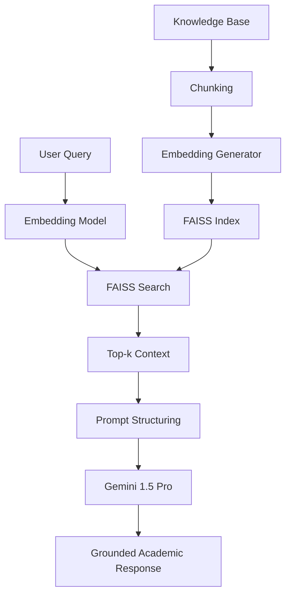

# Research-Grade RAG Chatbot: Comparative Evaluation

This project implements a Retrieval-Augmented Generation (RAG) chatbot designed for academic research. It specifically focuses on providing a baseline for comparative evaluation against intent-based systems.

## Architecture
The system follows a modular RAG architecture:
1.  **Preprocessing**: PDF/TXT files are cleaned and split into 400-token chunks with a 50-token overlap.
2.  **Embedding**: Uses `all-MiniLM-L6-v2` from SentenceTransformers for high-quality semantic representations.
3.  **Vector Store**: FAISS (Facebook AI Similarity Search) provides efficient top-k retrieval.
4.  **Generation**: Gemini 1.5 Pro generates grounded responses using a structured academic prompt.
5.  **API Layer**: FastAPI handles requests and returns both responses and retrieval metadata.

## Setup Instructions

### 1. Prerequisites
- Python 3.9+
- Gemini API Key

### 2. Installation
```bash
pip install -r requirements.txt
```

### 3. Configuration
1.  Copy `.env.example` to `.env`.
2.  Add your `GEMINI_API_KEY` to the `.env` file.

### 4. Data Preparation
Place your research papers (PDF or TXT) in `data/raw_docs/`.

## Running the Pipeline

1.  **Preprocess Documents**:
    ```bash
    python -m scripts.preprocess
    ```
2.  **Generate Embeddings**:
    ```bash
    python -m scripts.embed
    ```
3.  **Start the API Server**:
    ```bash
    uvicorn api.app:app --reload
    ```

## Research Evaluation Design
The implementation includes a dedicated `evaluation/` module for benchmarking:
- **Retrieval Metrics**: Top-1 and Top-3 accuracy, MRR.
- **Generation Metrics**: Latency tracking, placeholders for BLEU/ROUGE, and hallucination logging.
- **Logging**: All queries and retrieval metadata are logged to `rag_system.log` for post-hoc analysis.

## Customization
You can modify the following parameters in `config.py`:
- `CHUNK_SIZE`: Default is 400 tokens.
- `TOP_K`: Default is 5 retrieved chunks.
- `TEMPERATURE`: Default is 0.2 for low-hallucination grounded responses.

## RAG Flow Diagram

